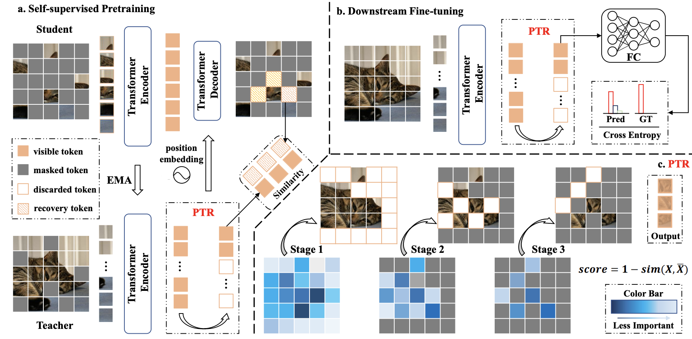
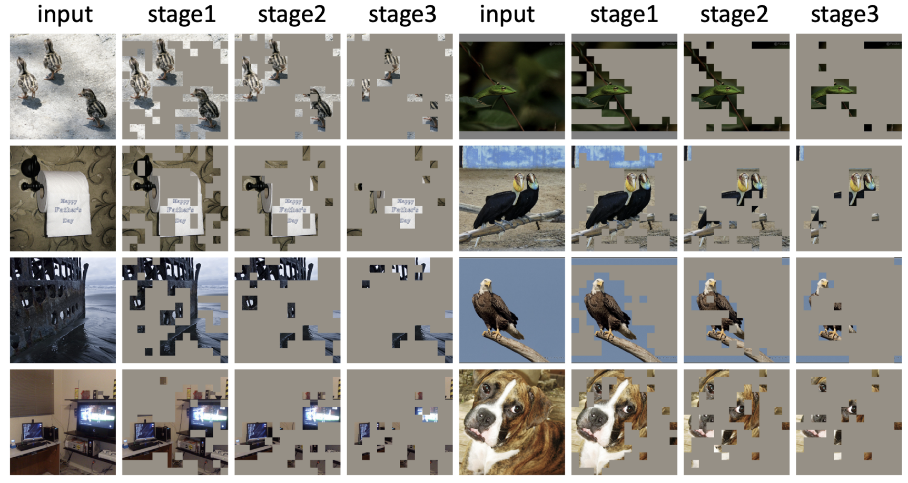
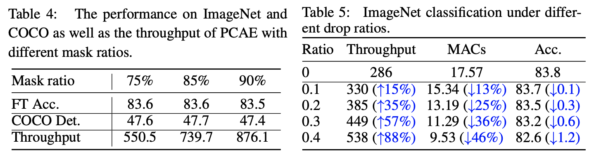

# [ICLR 2023] Progressively Compressed AutoEncoder for Self-Supervised Representation Learning

This code is modified from MAE: https://github.com/facebookresearch/mae.

As the source code is private asset, it cannot be made publicly availabel. While we have tried our best to reproduce it, its results has not empirically validated. Please feel free to contact us if you have any questions.

PCAE accelerates MIM pre-training by selectly recovering only key information in images. PCAE progressively discards redundant tokens in the forward pass of the momentum encoder, keeping only around 10% tokens for reconstruction. Visualizations show that PCAE manages to retain semantic-rich regions while neglecting trivial ones. 

In this way, PCAE enjoys much fast throughput without compromising performance compared to previous MIM methods. Additionally, PCAE can be depolyed in downstream tasks. The results are presented in the following, and please refer to [our paper](https://openreview.net/pdf?id=8T4qmZbTkW7) for more details. 

### Citation
If this code has been useful for your research, please consider citing it as follows:

    @inproceedings{
    li2023progressively,
    title={Progressively Compressed Auto-Encoder for Self-supervised Representation Learning},
    author={Jin Li and Yaoming Wang and XIAOPENG ZHANG and Yabo Chen and Dongsheng Jiang and Wenrui Dai and Chenglin Li and Hongkai Xiong and Qi Tian},
    booktitle={The Eleventh International Conference on Learning Representations },
    year={2023},
    url={https://openreview.net/forum?id=8T4qmZbTkW7}
    }
